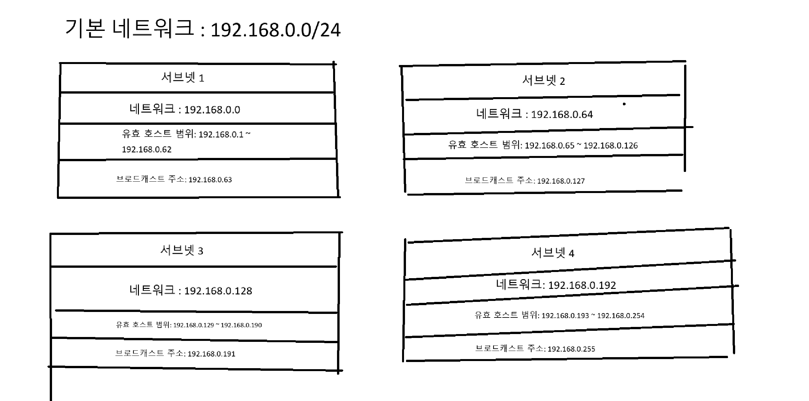
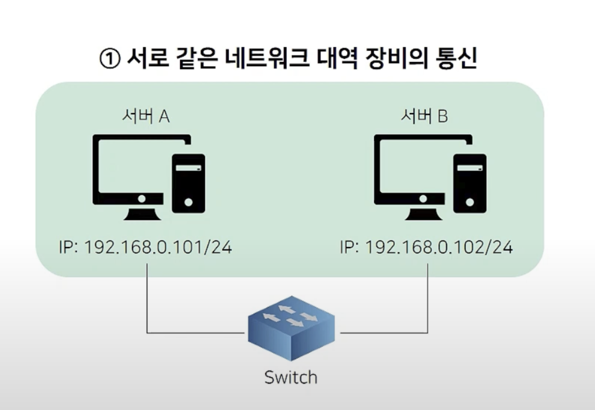
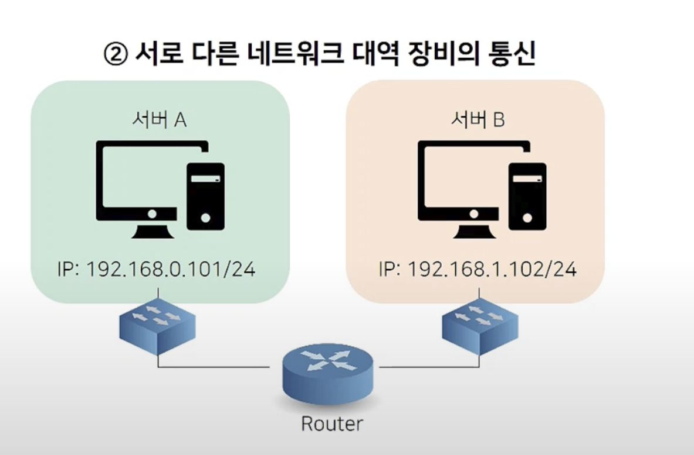

# 프로토콜
## 프로토콜이란?
: 프로토콜은 기본적으로 **컴퓨터나 네트워크 장치들이 서로 통신할 떄 따르는 규칙들의의 집합**이다.   
- 예를 들자면 사람들도 대화를 나눌때 언어를 사용하는데 서로 다른 언어를 사용하면 불편함을 겪는다.   
이것 처럼 컴퓨터들도 서로 이해할 수 있는 '공통언어', 즉 **프로토콜**이 필요하다.

## 프로토콜의 역할
- #### **데이터 포맷** : 데이터를 받을 떄나 보낼떄나 형식(포맷)을 맞춰주는 것 이다.
- #### **주소 지정** :  데이터를 어디로 보낼지 정확한 목적지를 알려주는 역할을 한다.
- #### **오류 관리** : 데이터 전송 중에 발생할 수 있는 오류를 감지하고 수정하는 방법이다.

## 프로토콜의 종류
- ### **HTTP**
   * 웹페이지와 이미지,영상 같은 **웹 자료를 주고받을 때 사용되는 규칙**이다.
   * 주로 웹 브라우저와 웹 서버 간의 통신에서 사용된다.
- ### **HTTPS**
    * HTTP에 **보안(암호화)을 추가**한 거다.
    * 해커가 보지 못하게 데이터를 안전하게 주고 받을 수 있다.
- ### **TCP**
    * 데이터를 **정확하고 안전**하게 보내기 위한 통신 규칙이다.
    * 중간에 빠진 거 없나 체크하고, 문제 있으면 다시 보내서 완벽하게 전달한다.

- ### **UDP**
   * TCP보다 더 빠르고 가벼운 통신 방법이다.
   * 예) 영상 스트리밍, 게임 같은게 살짝 끊겨도 괜찮은 경우

- ### **IP**
    * 데이터를 어디로 보낼 지 **주소를 정해주는 규칙**이다.
    * 모든 컴퓨터와 휴대전화는 자기 만의 IP주소를 가지고 있다.

- ### **FTP**
    * 파일을 인터넷을 통해 주고받는 규칙이다.
    * 서버랑 컴퓨터가 서로 파일을 보내거나 받을 때 사용한다.

- ### **SMTP**
   * 이메일을 보내는 규칙이다.
   * 우리가 메일을 보낼 때, 이 프로토콜이 뒤에서 메일 배달부처럼 일을 해준다.

 
 

# MAC,IP 주소란?
## MAC (Media Access Control)
: MAC 주소는  **네트워크 장치(랜카드)** 에 붙어 있는 고유 식별 번호이다.  
  이 주소는 공장에서 장치를 만들 때 정해지기 때문에 일반적으로 바뀌지 않는다.   
  네트워크 안에서 기기끼리 서로 구별하기 위해 만들어졌다. 
   

  → **쉽게 말하자면 사람의 주민등록번호이라고 생각하면 쉽다.**    
  #### MAC 주소 구조 : 
  * 6쌍의 16진수 (예: 00:1A:2B:3C:4D:5E)
  * 앞부분: 제조사 코드
  *  뒷부분: 장치 고유 번호

## IP (Internet Protocol)
: IP 주소는 **인터넷이나 네트워크에서 장비가 어디에 있는지 알려주는** 논리적 주소이다.  
공인 IP(인터넷에서 직접 통신 가능)와 사설 IP(내부 네트워크 전용)로 구분된다. 
 

  → **쉽게 말하면 편지를 주고 받기 위한 집 주소라고 생각하면 쉽다.**
 
#### IP 주소 종류:
* IPv4: 32비트 주소 (예: 192.168.0.1) → 숫자가 4개 점으로 구분
* IPv6: 128비트 주소 (예: 2001:db8::1) → 더 복잡하고 길어짐 (IP 부족 문제 해결)

## IP주소 와 MAC주소의 차이점
| 항목 | IP 주소 | MAC 주소 |
|:---|:---|:---|
| **정의** | 인터넷 상에서 장치를 식별하는 논리적 주소 | 네트워크 장치(랜카드)에 부여된 물리적 고유 주소 |
| **역할** | 네트워크 간 데이터 전달(주소 지정) | 같은 네트워크 안에서 장치 식별 |
| **형식** | IPv4: 192.168.0.1 / IPv6: 2001:db8::1 | 00:1A:2B:3C:4D:5E (16진수 6쌍) |
| **사용 계층** | 네트워크 계층 (OSI 3계층) | 데이터 링크 계층 (OSI 2계층) |
| **주요 용도** | 전 세계 인터넷 통신 | 로컬 네트워크 내부 통신 | 

 
 

# 스위칭
: 스위칭은 **네트워크 안에서 데이터가 어디로 가야 하는 지** 정해주는 기술이다.   
컴퓨터나 장치들이 통신할때 누가 누구한테 데이터를 보내야 하는지 정확하게 연결해주는 역할을 한다.   
스위칭은 네트워크 장비인 **스위치** 안에서 일어난다고 생각하면 좋다.
 

→ **쉽게 말하자면 교통경찰이 차들 방향을 안내해주는 것 과 비슷하다.**   

## 역할
* #### **데이터 전송 경로 설정** : 데이터가 목적지 까지 가장 빠르고 정확하게 가도록 길을 선택해준다.
* #### **네트워크 혼잡 줄이기** : 필요한 곳에만 데이터를 보내서, 불필요한 트래픽을 줄인다.
* #### **충돌방지** : 데이터를 아무데나 보내지 않고 정확하게 연결해서 충돌이나 손실을 막는다.

 

## 스위칭 종류
* ### **회선 교환**
   - 통신할 때 두 장비사이에 전용통로를 만든다.
   - 예) 전화통화
* ### **패킷 교환**
   - 데이터를 작게 나눠 각각 독립적으로 보내고, 목적지에서 다시 합친다.
   - 예) 인터넷,메신저

* ### **메시지 교환**
   - 전체 메세지를 한번 저장한뒤  다음 경로로 천천히 보낸다.
   - 예) 옛날 네트워크 시스템

## 스위칭 장비 : 스위치
* #### **스위치는 MAC주소를 보고 데이터가 어디로 가야 할지 결정한다.**
* #### **필요한 장치에만 데이터를 보내서, 속도도 빠르고 충돌도 없다.**
* #### **반대로, 허브는 모든 장치에 뿌려서 비효율적이다.**

**스위치는 MAC 주소를 기반으로 통신 상대를 찾지만,  
처음에는 IP 주소밖에 모르기 때문에 MAC 주소를 알아내는 과정이 필요하다.  
이 과정을 담당하는 것이 바로 ARP이다.**

 

# ARP (Address Resolution Protocol)
: **IP 주소를 이용해서 MAC 주소를 찾기위한 프로토콜**이다.   
 IP 주소만으로 데이터를 정확하게 보낼 수 없고,   
 장비의 MAC 주소를 사용해서 통신이 이루어지기 때문에, IP와 MAC을 연결해주는 역할을 한다.

-----

   ### 왜 IP주소와 MAC주소 둘다 필요할까? 
   * #### **왜 하필 IP → MAC 주소의 절차대로 통신을 해야할까?**
       * **IP주소는 네트워크까지만 갈수 있고 IP는 변경될 수 있기 때문에**
       *  **히지만 실제 통신을 위해서는 변하지 않는 MAC주소를 알아야 한다.**
       * **IP주소만 가지고는 정확한 장비를 찾을 수 없어서, 마지막엔 꼭  MAC주소를 이용해서 찾아야한다**
   * #### **처음 부터 MAC주소로 통신하면 되지 않을까?**
       * **MAC주소는 너무 세부적인 정보라서, 인터넷처럼 큰 네트워크에서 쓰기에는 비효율적이다.**
       * **MAC주소만으로 통신하게되면 네트워크 전체를 뒤져야 해서 시간이 오래 걸리지만,**    
          **IP주소를 쓰면 빠르게 목적지를 찾을 수 있다.**   
          → 쉽게말하면 IP는 도로명주소이고 MAC은 개인주소라고 생각하면 편하다.

## 동작 과정(간단히)
* ### **ARP 요청**
   *  브로드캐스트로 네트워크 전체에    
     * "이 IP주소 가진 사람 누구야? MAC주소좀 알려줘"라고 물어본다
* ### **ARP 응답**
    * 해당 IP를 가진 장비가 "나야 내 MAC주소는 이거야"라고 대답한다.
* ### **ARP 캐시 저장**
    * 한 번 알아낸 MAC주소는 메모리에 잠시 저장해두고   
    *  다음에 바로 쓸 수 있도록 있게 한다.    
        → 하지만 일정시간이 지나면 캐시가 삭제 되어 다시 ARP 요청을 해야한다.

 
 

# 서브넷
## 퍼블릭IP,프라이빗IP 란?
   * #### **퍼블릭IP** : 인터넷에서 모두가 접근 할 수 있는 IP주소이다.(전세계에 어디서든 가능)
   * #### **프라이빗IP** : 내부 네트워크(회사,집 등)에서만 쓰는 IP주소이다.(인터넷에서는 직접접근 불가능)
## 서브넷이란?
: 서브넷은 말 그대로 큰 네트워크를 잘게 나눈 작은 네트워크 공간을 말한다.
  

## 서브넷을 왜 사용할까?
: 그렇다면 왜 서브넷을 사용하여 네트워크를 나눌까?
* #### **보안**
   * 중요한 서비스나 시스템은 외부랑 완전히 분리해두는게 안전하기 때문에 각각 다른 서브넷에 넣어서 따로 관리한다.
* #### **트래픽 관리** 
    *  같은 네트워크에 너무 많은 장비가 몰려있으면 서로 얽혀서 통신이 복잡해진다.
      그래서 기능별로 서브넷을 나눠서 꼭 필요한 통신만 오가게 할 수 있다.
* #### **IP 관리**  
    * 예를 들어 회사에서 하나의 대역만 쓰면,누가 얼마만큼 IP를 쓰는지 알기도 어렵고 낭비가 생긴다.   
      이때 서브넷을 나눠 놓으면 더 낭비도 안생기고 깔끔하게 나눠서 사용이 가능하다.
* #### **성능 향상** 
    * 네트워크 안에 너무 많은 장비과 몰리면 전체로 퍼지는 브로드캐스트 트래픽도 많아진다.
     하지만 서브넷으로 나눠두면 그런 불 필요한 신호가 줄어들고, 전체 속도도 좋아진다.

## 서브넷 구성 요소

* #### **네트워크 주소**
     * 이 서브넷이 어디서부터 시작되는지 알려주는 주소를 말한다.
* #### **서브넷 마스크**
     * 전체 IP주소 중에서 어디까지가 네트워크이고 컴퓨터인지 구분해주는 선이다.
     (32비트 숫자로 구성되며, 인터넷에 연결된 각 장치에 고유하게 해당된다.)
* #### **호스트주소**
    * 네트워크에 연결된 개발 장치(컴퓨터,서버 등 )에 할당되는 주소를 말한다.
* #### **브로드 캐스트 주소**
    * 서브넷 내 모든 장비에 메세지를 보낼 때 사용하는 주소를 말한다.

## 서브넷 그리기

 

## 퍼블릭 서브넷과 프라이빗 서브넷
: 하나의 네트워크 안에서, 인터넷과 직접 연결할 수 있느냐에 따라 나뉘는 구역이다.   
서브넷은 여러 컴퓨터(서버)들이 모여 있는 작은 네트워크 공간이라고 생각하면 된다.

## 퍼블릭 서브넷(AWS)
: 외부와 자유로운 통신이 가능하고 인터넷과 **직접 통신**이 가능한 서브넷이다.     

* #### **특징**
  * 외부에서 직접 접근할 수 없기 때문에 보안성이 높다.
  * 공인 IP 주소를 사용한다.
  * 외부에서 직접 접근이 가능하다.
  * 인터넷게이트웨이를 통해 외부 인터넷과 통신한다.

## 프라이빗 서브넷(AWS)
: 외부에서 직접 접근을 허용하지 않고, 내부 리소스를 안전하게 유지되는데 사용된다.    
주로 데이터 베이스,서버,애플리케이션 서버 등에 프라이빗 서브넷이 위치하여 사용된다.

* #### **특징**
   * 사설 IP주소가 사용된다.
   * 외부에서의 접근이 차단되기 때문에 NAT 게이트웨이를 통해서 이루어진다.

 
 

# 라우팅
## 라우팅 개념
: 네트워크 안에서 정보를 가장 알맞은 길로 보내주는 과정을 말한다.      
정보를 주고 받을 때 여러가지의 길을 통해 보낼 수 있는데 라우팅은 그중에서 가장 빠르거나 효율적인 길을 골라주는 역할을 한다.   
**→ 이러한 인터넷 라우팅 결정은 라우터란 네트워크 하드웨어가 결정한다.**   
## 라우팅 작동 원리(간단하게)
 * ####  라우터가 데이터(패킷)를 받으면
 * ####  그 안에 적힌 목적지 주소를 확인하고 
 * ####  라우팅 테이블(라우터에게 지도같은 역할)을 참고해
 * ####  다음에 어디로 보내야 할지 결정한다.

 
 

 # NAT
 ## NAT/네트워크 주소 변환 이란?
 : 인터넷을 사용할 때 여러 대의 기기가 하나의 IP주소를 함께 사용할 수 있도록 도와주는 기술이다. nat을 사용하게 되면 하나의 공인 IP주소로 여러개의 사설 IP주소와 매핑할 수 있다.
 또 NAT는 라우터나 게이트웨이 장비에서 동작한다.

 ## 종류
 * #### 정적 NAT 
    *  하나의 내부 IP주소를 하나의 공인 IP 주소에 1:1로 연결한다.   
       주로 외부에서 내부 네트워크에 특정 서버에 접근할 때 사용된다.
* #### 동적 NAT
     * 내부 IP주소를 사전에 정의된 공인 IP 주소 풀(네트워크자원을 모아둔 공간) 중 하나로 연결된다.   
     내부 주소와 공인 주소 비율이 1:1이지만, 연결은 고정적이지 않고 동적으로 할당된다.
* #### PAT/NAT 오버로드
     * 여러 내부 IP 주소를 단일 공인 IP로 연결하지만,   
     각 연결을 구분하기 위해서 포트 번호(프로그램간 통신을 구분하는 번호)를 사용한다.

 
 

# 사설 IP를 갖고 있는 pc가 외부 네트워크와 통신하는 과정
먼저 사설 IP를 갖고 있는 PC는 일반적으로 가정이나 회사의 내부 네트워크에 속해 있으며, 이 IP 주소는 외부 인터넷에서는 직접적으로 인식되지 않는다. 이러한 사설 IP 주소는 여러 네트워크에서 중복해서 사용할 수 있도록 설계되어서 인터넷에서는 고유하지 않기 때문에 외부에서 직접 통신할 수 없다. 그래서 이때 사용되는게 NAT이다.

 ### **NAT**
 * **사설 IP를 가진 컴퓨터가 인터넷에 접속하려고 하면, NAT가 이 IP를 공인 IP로 바꿔서 밖으로 보내준다.**

 * **외부 서버에서 응답이 돌아오면, NAT는 이 응답이 어떤 컴퓨터로 가야 하는지 확인해서 다시 원래 컴퓨터한테 보내준다.**

 * **NAT는 누가 요청을 보냈는지 잠깐 기억해두고, 응답이 올 때 그걸 바탕으로 정확히 다시 전달해준다.**

 * **덕분에 여러 대의 컴퓨터가 하나의 공인 IP를 같이 써도 문제없이 인터넷을 사용할 수 있고, 외부에서 내부 컴퓨터들이 바로 보이지 않아서 보안에서도 효과적 이다.**

 
 

# 같은 대역에 있는 PC가 서로 통신하는 과정
같은 대역에 있다는 것은 IP주소의 네트워크 부분이 같고 서브넷 마스크도 동일하다는 것 이다.   
또 같은 대역에 있는 PC들끼리는 라우터 없이 통신이 가능하다.

### 통신 과정

* **서버A이 서버B에게 데이터를 보내기 위해 먼저 MAC주소를 알아야한다.**
* **그러므로 서버A는 요청을 브로드캐스트로 전송**
* **서버B가 응답하면**
* **서버 A는 응답받은 MAC 주소를 ARP 테이블에 저장하고**
**이제부터는 바로 MAC 주소로 데이터 전송한다.**

 
 

# 서로 다른 서브넷 대역에 있는 pc가 서로 통신하는 과정
이 경우에서는 라우터를 사용해서 통신해야한다.   
### 통신과정(라우팅)

 * **서버 A가 서버 B에게 데이터를 보내려는데, 다른 네트워크에 있어서 직접 못 보내는 상황일때**

* **그래서 대신 라우터에게 보내기로 한다.**

* **라우터 주소(MAC 주소)를 ARP로 물어보고, 데이터를 라우터에 보낸다.**

* **라우터는 라우팅 테이블을 보고 길을 찾은다.**

* **서버 B 쪽 네트워크에 도착하면, 다시 ARP로 서버 B의 MAC 주소를 알아낸다.**

* **MAC 주소를 알아낸 뒤 데이터를 서버 B에게 전달한다.**

* **서버 B도 같은 경로로 응답을 보냄**

