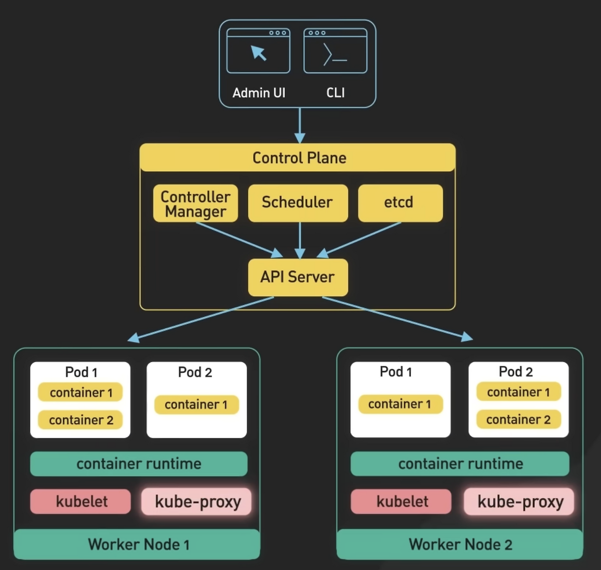

# 쿠버네티스의 시작

구글에서 시작한 서비스로 원래 구글이 사용하던 Borg에서 시작하게 되었다. 
구글에는 방대한 서비스가 많기 때문에 방대한 서비스들을 안정적이고 유연하게 운영하기 위해 Borg를 개발하여 사용하기 시작했다.

구글을 Borg + Omega의 개념을 바탕으로 kubernetes를 개발하였고 오픈소스 프로젝트로 공개 되었다.

> borg : 수천 대의 서버에서 컨테이너를 자동으로 배포하고 관리하고 오류 발생 시 자동 복구 등                        높은 안정성과 확장성을 제공하였다.      
Omega : borg의 한계 점 개선을 위해 여러 스케 줄러가 동시에 독립적으로 작동하면서 공유 저장소를 통해 협력하는 분산 구조를 가지는 버전이다.

# 쿠버네티스란?

컨테이너화 된 운영들을 자동화를 통해 서비스를 안정적이고 유연하게 서비스 운영을 할 수 있다. 
또한 오픈소스의 플렛폼이기 때문에 확장하기 쉽다.

즉, 컨테이너를 오케스트레이션 하는 도구라고 보면 된다.

- **선언적 방식(Declarative)**
    
    : 쿠버네티스는 선언적 방식으로 동작한다.                                                                                                       개발자는 “어떻게 할지”가 아닌 “어떤 상태가 되길 원하는지”만 정의한다.
    
    개발자는 YAML 파일을 통해 원하는 상태를 선언하고                                                                                 쿠버네티스는 현재 상태와 비교하여 자동으로 맞추는 역할을 한다.
    
- **명령형 방식(Imperative)**
    
    : 시스템에게 무엇을 어떻게 할지 를 하나씩 직접 명령하는 방식이다.                                                          개발자는 리소스를 생성·수정·삭제하는 과정을명령어로 직접 수행한다.
    

# 클러스터 구조(Control Plane VS Worker Node)

### Control Plane Node

**: 클러스터를 관리하고 결정을 내리는 핵심적인 뇌와 같은 역할이다.**

- **API sever**
    1.  쿠버네티스 api를 노출하는 컴포넌트(REST 유형)
    2. 모든 요청이 시작되는 장소
    3. 흔히 kubectl ~ 로 시작하는 명령어가 API Server 를 타고 요청 보냄
- **etcd**
    1. 쿠버네티스의 모든 정보가 저장되는 곳
    2. 제일 중요한 요소라 백업 필수
- **controller manager**
    1. node의 pod를 수정하거나 복구하는 역할
    2. 원하는 상태에 맞춰서 클러스터를 유지해주는 작업자
    3. ectd를 계속해서 상태를 점검, 차이점이 있을 시 조정하는 역할
- **Scheduler**
    1. 새롭게 생겨 할당이 안된 pod가 존재한다면 어떤 노드에 보낼지 결정
    2. CPU, 메모리, affinity, taint/toleration 같은 기준을 기반으로 결정
    
    > Affinity: 배치 선호/조건  
    Taint: 노드의 출입 제한  
    Toleration: 제한을 무시하는 Pod 권한
    

### Worker Node

**: Control Plane의 지시에 따라 실제로 애플리케이션(컨테이너)을 실행하는 현장 역할이다.**

- **Kubelet**
    1. worker node에서 control plane과 api server로 통신하는 담당
        
        → 주로 pod의 상태체크
        
    2. pod의 상태를 체크하고 필요한 조치를 취하며, 클러스터 상태를 유지
    3. pod에 리소스 요청, 제한에 맞는 리소스를 할당하려고 노력
    
    → 주로 pod의 상태관리와 컨테이너 실행 및 관리, Health Check등 Node에 돌아가는                               Pod를 관리하는 역할
    
- **Kube-Proxy**
    1. Cluster 내의 pod 통신 담당 → 서비스의 로드밸런싱도 담당
    2. Cluster 외부 통신도 담당
    
    → iptables나 ipvs를 사용하여 Cluster IP와 NodePort로 들어오는 요청을 적절한 Pod으로 전달